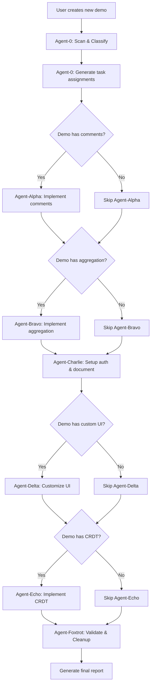
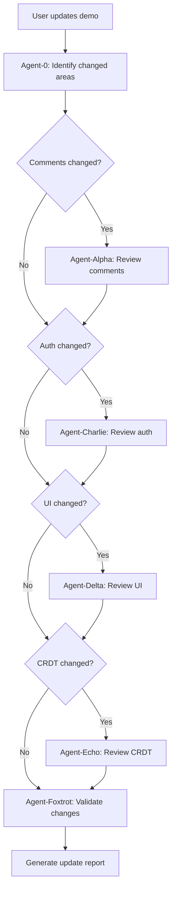
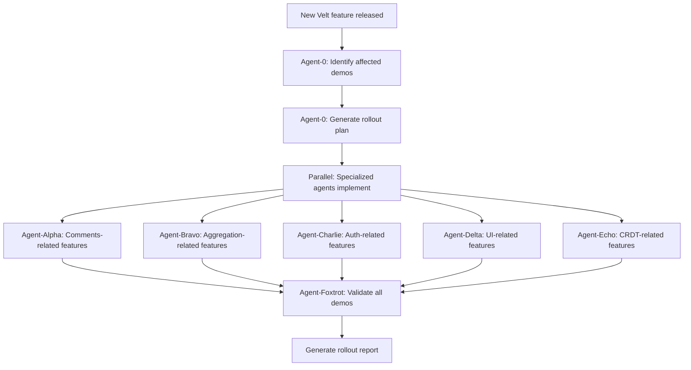

# React Demos Multi-Agent Functional Blueprint

> **Version**: 1.0.0
> **Last Updated**: 2025-11-10
> **Purpose**: Define agent collaboration framework for managing, implementing, and validating functionality across React demo applications in the sample-apps monorepo.

---

## Table of Contents

1. [Overview](#overview)
2. [Demo Classification Map](#demo-classification-map)
3. [Stage 1: Discovery & Classification (Agent-0)](#stage-1-discovery--classification-agent-0)
4. [Stage 2: Functional Implementation (Agent-Alpha → Agent-Echo)](#stage-2-functional-implementation-agent-alpha--agent-echo)
5. [Stage 3: Validation & Cleanup (Agent-Foxtrot)](#stage-3-validation--cleanup-agent-foxtrot)
6. [Agent Hand-off Workflows](#agent-hand-off-workflows)
7. [Shared QA Checklist](#shared-qa-checklist)
8. [Velt CLI Integration](#velt-cli-integration)
9. [Implementation Standards](#implementation-standards)

---

## Overview

This blueprint defines a **7-agent system** for automating the lifecycle of Velt integration across 13 React demo applications. The system operates in three stages:

- **Stage 1**: Discovery & Classification (Agent-0 Coordinator)
- **Stage 2**: Functional Implementation (Agents Alpha, Bravo, Charlie, Delta, Echo)
- **Stage 3**: Validation & Cleanup (Agent-Foxtrot)

### Agent Roles Summary

| Agent | Role | Responsibility |
|-------|------|----------------|
| **Agent-0** | Coordinator | Scan, classify, generate metadata, orchestrate workflow |
| **Agent-Alpha** | Comments & Annotations | Popover comments, bubble UI, positioning, targeting logic |
| **Agent-Bravo** | Comment Aggregation | Sidebar, table views, grouping, filtering |
| **Agent-Charlie** | Auth & Document Setup | VeltInitializeUser, VeltInitializeDocument, permissions |
| **Agent-Delta** | UI Customization | Wireframes, dark mode, styling, component hierarchy |
| **Agent-Echo** | CRDT & Live State | Real-time editing, Yjs integration, Recorder features |
| **Agent-Foxtrot** | Validation & Cleanup | QA verification, redundancy removal, final report |

---

## Demo Classification Map

### Summary Statistics

- **Total Demos**: 14
- **Demo Categories**: 2 (Comments, CRDT)
- **Demo Types**: 4 (Tables, Text Editors, Canvas, Dashboard)
- **Velt Features**: Comments, Presence, Notifications, CRDT
- **Editor Integrations**: 7 (AG-Grid, TanStack, Tiptap, Lexical, BlockNote, CodeMirror, Slate.js, ReactFlow)

### Classification Table

| Demo ID | Demo Name | Type | Category | Location | Velt Features | CRDT | Special Package |
|---------|-----------|------|----------|----------|---------------|------|-----------------|
| D01 | AG-Grid Single-Tool | Table | Comments | `comments/tables/ag-grid/single-tool` | Comments, Presence, Notifications | No | None |
| D02 | AG-Grid Multiple-Tools | Table | Comments | `comments/tables/ag-grid/multiple-tools` | Comments, Presence, Notifications | No | None |
| D03 | AG-Grid Aggregation | Table | Comments | `comments/tables/ag-grid/comment-aggregation` | Comments, Presence, Notifications | No | None |
| D04 | TanStack Single-Tool | Table | Comments | `comments/tables/tanstack/single-tool` | Comments, Presence, Notifications | No | None |
| D05 | TanStack Multiple-Tools | Table | Comments | `comments/tables/tanstack/multiple-tools` | Comments, Presence, Notifications | No | None |
| D06 | TanStack Aggregation | Table | Comments | `comments/tables/tanstack/comment-aggregation` | Comments, Presence, Notifications | No | None |
| D07 | Tiptap Comments | Text Editor | Comments | `comments/text-editors/tiptap/tiptap-comments-demo` | Comments, Presence, Notifications | No | @veltdev/tiptap-velt-comments |
| D08 | Lexical Comments | Text Editor | Comments | `comments/text-editors/lexical/lexical-comments-demo` | Comments, Presence, Notifications | No | @veltdev/lexical-velt-comments |
| D09 | BlockNote | Text Editor | Comments | `comments/text-editors/blocknote/blocknote-demo` | Comments, Presence, Notifications | Yes | @veltdev/blocknote-crdt-react |
| D10 | CodeMirror | Text Editor | Comments | `comments/text-editors/codemirror/codemirror-demo` | Comments, Presence, Notifications | Yes | @veltdev/codemirror-crdt-react |
| D11 | Slate.js Comments | Text Editor | Comments | `comments/text-editors/slatejs/slatejs-comments-demo` | Comments, Presence, Notifications | No | @veltdev/slate-velt-comments |
| D12 | Tiptap CRDT | Text Editor | CRDT | `crdt/tiptap-crdt-demo` | Comments, Presence, Notifications, Real-time Editing | Yes | @veltdev/tiptap-crdt-react |
| D13 | ReactFlow Canvas | Canvas | CRDT | `crdt/canvas/reactflow/reactflow-demo` | Comments, Presence, Notifications, Real-time Canvas | Yes | @veltdev/reactflow-crdt |
| D14 | Dashboard Demo | Dashboard | Comments | `comments/dashboard/custom/dashboard-demo` | Comments, Presence, Notifications | No | None |

### Demo Grouping by Agent Responsibility

#### Agent-Alpha Scope (Comments & Annotations)
- **All 14 demos** implement comment functionality
- **Focus Areas**: Comment targeting, bubble UI, click-to-comment patterns, panel-level comments (Dashboard)

#### Agent-Bravo Scope (Comment Aggregation)
- D03: AG-Grid Aggregation
- D06: TanStack Aggregation
- D14: Dashboard Demo (embedded VeltCommentsSidebar)
- **All demos with VeltCommentsSidebar**

#### Agent-Charlie Scope (Auth & Document Setup)
- **All 14 demos** require authentication and document initialization

#### Agent-Delta Scope (UI Customization)
- **All demos with custom wireframes** (most demos)
- Focus: `ui-customization/` directories

#### Agent-Echo Scope (CRDT & Live State)
- D09: BlockNote (CRDT support)
- D10: CodeMirror (CRDT support)
- D12: Tiptap CRDT
- D13: ReactFlow Canvas

---

## Stage 1: Discovery & Classification (Agent-0)

### Agent-0: Coordinator Agent

**Objective**: Automatically scan, classify, and orchestrate the entire workflow across all React demos.

#### Responsibilities

1. **Auto-Discovery**
   - Scan all folders under `apps/react/`
   - Identify demo type (Table, Text Editor, Canvas)
   - Detect Velt integration files and patterns
   - Classify functional areas present in each demo

2. **Metadata Generation**
   - Create `demo-map.json` with structured data for each demo
   - Generate markdown summary tables
   - Document entry points and key components
   - Identify Velt-specific files and conventions

3. **Workflow Orchestration**
   - Determine which specialized agents need to work on each demo
   - Generate task assignments for Agents Alpha → Echo
   - Track progress across all demos
   - Coordinate hand-offs between agents

4. **Reporting**
   - Generate `agent-0-discovery-report.md` with findings
   - Create task manifests for downstream agents
   - Flag inconsistencies or missing patterns

#### Discovery Checklist

- [ ] Scan all directories under `apps/react/`
- [ ] Identify demo categories (Comments, CRDT)
- [ ] Classify demo types (Table, Text Editor, Canvas)
- [ ] Detect Velt features (Comments, Presence, Notifications, CRDT)
- [ ] Map editor-specific integrations (AG-Grid, TanStack, Tiptap, etc.)
- [ ] Identify entry points (`app/page.tsx`)
- [ ] Locate Velt component files (`components/velt/`)
- [ ] Check for API endpoints (`app/api/velt/token/route.ts`)
- [ ] Detect UI customization patterns (`ui-customization/`)
- [ ] Generate `demo-map.json`
- [ ] Create task assignments for specialized agents

#### Output Artifacts

1. **`demo-map.json`**
   ```json
   {
     "metadata": {
       "version": "1.0.0",
       "generatedAt": "2025-11-10T00:00:00Z",
       "totalDemos": 13,
       "categories": ["comments", "crdt"],
       "demoTypes": ["table", "text-editor", "canvas"]
     },
     "demos": [
       {
         "id": "D01",
         "name": "AG-Grid Single-Tool",
         "type": "table",
         "category": "comments",
         "path": "comments/tables/ag-grid/single-tool",
         "entryPoint": "app/page.tsx",
         "veltFeatures": ["comments", "presence", "notifications"],
         "hasCRDT": false,
         "editorIntegration": "ag-grid",
         "veltPackages": ["@veltdev/react"],
         "keyFiles": [
           "components/velt/VeltCollaboration.tsx",
           "components/velt/VeltInitializeUser.tsx",
           "components/velt/VeltInitializeDocument.tsx",
           "app/api/velt/token/route.ts"
         ],
         "uiCustomization": true,
         "agentAssignments": {
           "alpha": true,
           "beta": false,
           "charlie": true,
           "delta": true,
           "echo": false
         }
       }
       // ... other demos
     ]
   }
   ```

2. **`agent-0-discovery-report.md`**
   - Human-readable summary of findings
   - Classification tables
   - Agent task assignments
   - Identified patterns and conventions
   - Flagged inconsistencies or issues

3. **`agent-tasks.json`**
   ```json
   {
     "agent-alpha": {
       "demos": ["D01", "D02", ..., "D13"],
       "priority": "high",
       "tasks": [
         "Verify comment targeting logic in table demos",
         "Ensure consistent comment bubble UI",
         "Validate text selection annotations in editors"
       ]
     },
     "agent-bravo": {
       "demos": ["D03", "D06"],
       "priority": "medium",
       "tasks": [
         "Review comment aggregation patterns",
         "Verify sidebar filtering logic"
       ]
     }
     // ... other agents
   }
   ```

#### Agent-0 Invocation

```bash
# Command to invoke Agent-0
claude-code --agent agent-0 --stage discovery --output-dir .claude/reports/
```

**Expected Output Location**: `.claude/reports/discovery/`

---

## Stage 2: Functional Implementation (Agent-Alpha → Agent-Echo)

### Agent-Alpha: Comments & Annotations Specialist

**Objective**: Implement and validate all comment-related functionality across demos.

#### Scope

- **All 14 demos** (every demo has comment features)
- Focus on comment targeting, bubble UI, positioning, and annotation logic

#### Responsibilities

1. **Comment Targeting**
   - Verify `data-velt-target-comment-element-id` attributes
   - Ensure click-to-comment patterns work correctly
   - Validate text selection in editors
   - Check canvas element targeting in ReactFlow

2. **Comment Bubble UI**
   - Implement/verify `VeltCommentBubbleWf.tsx` customization
   - Ensure consistent bubble positioning
   - Validate bubble appearance and styling

3. **VeltComments Component**
   - Verify `<VeltComments>` integration
   - Check comment threads rendering
   - Validate reply and resolve functionality

4. **Editor-Specific Integration**
   - Tiptap: `TiptapVeltComments` extension
   - Lexical: `@veltdev/lexical-velt-comments` plugin
   - BlockNote: Comment integration
   - CodeMirror: Comment overlay logic
   - Slate.js: `@veltdev/slate-velt-comments` integration

5. **Table-Specific Integration**
   - AG-Grid: Cell-level comment targeting
   - TanStack: Row/cell comment anchoring
   - Verify single-tool vs. multiple-tools patterns

#### Implementation Checklist

- [ ] Review all VeltComments component instances
- [ ] Verify comment targeting logic for each demo type
- [ ] Check bubble positioning and styling
- [ ] Validate text selection comment creation
- [ ] Test click-to-comment flows in table demos
- [ ] Ensure canvas element comments work in ReactFlow
- [ ] Add `[Velt]` annotations to all comment-related code
- [ ] Document any custom comment patterns

#### Code Standards

```tsx
// [Velt] Comment targeting pattern for table cells
const cellId = `cell-${rowId}-${columnField}`;
parentCell.setAttribute('data-velt-target-comment-element-id', cellId);

// [Velt] Text editor comment integration (Tiptap example)
import TiptapVeltComments from '@veltdev/tiptap-velt-comments';

const editor = useEditor({
  extensions: [
    StarterKit,
    TiptapVeltComments, // [Velt] Enable comments on text selections
  ],
});

// [Velt] Comment bubble customization
<VeltCommentBubbleWf>
  <div className="custom-bubble">
    {/* Custom UI */}
  </div>
</VeltCommentBubbleWf>
```

#### Output Artifacts

- `agent-alpha-report-{demoId}.md` for each demo
- Updated component files with `[Velt]` annotations
- Test results for comment functionality

---

### Agent-Bravo: Comment Aggregation & Sidebar Specialist

**Objective**: Implement and validate comment aggregation, sidebar views, grouping, and filtering.

#### Scope

- D03: AG-Grid Aggregation
- D06: TanStack Aggregation
- All demos with `VeltCommentsSidebar` component

#### Responsibilities

1. **Comment Sidebar**
   - Verify `<VeltCommentsSidebar>` integration
   - Ensure sidebar toggle functionality
   - Check comment list rendering

2. **Aggregation Views**
   - Review comment aggregation patterns in table demos
   - Verify grouping by row, column, or user
   - Check filtering and sorting logic

3. **Sidebar Button**
   - Implement/verify `VeltSidebarButtonWf.tsx` customization
   - Ensure consistent positioning and styling

4. **Comment Counts**
   - Verify comment count badges
   - Check real-time count updates

#### Implementation Checklist

- [ ] Review VeltCommentsSidebar in all demos
- [ ] Verify aggregation logic in D03 and D06
- [ ] Check sidebar toggle button functionality
- [ ] Validate comment grouping and filtering
- [ ] Test real-time comment count updates
- [ ] Add `[Velt]` annotations to sidebar-related code

#### Code Standards

```tsx
// [Velt] Comment sidebar integration
<VeltCommentsSidebar>
  {/* Sidebar content renders automatically */}
</VeltCommentsSidebar>

// [Velt] Custom sidebar button
<VeltSidebarButtonWf>
  <button className="sidebar-toggle">
    Comments ({commentCount})
  </button>
</VeltSidebarButtonWf>
```

#### Output Artifacts

- `agent-bravo-report.md`
- Updated sidebar components with annotations
- Aggregation pattern documentation

---

### Agent-Charlie: Access Control & Document Initialization Specialist

**Objective**: Implement and validate authentication, user management, and document initialization.

#### Scope

- **All 14 demos** (every demo requires auth and document setup)

#### Responsibilities

1. **Authentication Flow**
   - Verify `VeltInitializeUser.tsx` implementation
   - Check `useVeltAuthProvider()` hook usage
   - Validate JWT token generation via `/api/velt/token`
   - Ensure user context from `useAppUser.ts`

2. **Document Initialization**
   - Verify `VeltInitializeDocument.tsx` implementation
   - Check `useSetDocuments()` hook usage
   - Validate document ID and metadata setting
   - Ensure document context from `useCurrentDocument.ts`

3. **API Token Endpoint**
   - Review `app/api/velt/token/route.ts`
   - Verify server-side JWT generation
   - Check environment variable usage (VELT_API_KEY, VELT_AUTH_TOKEN)
   - Validate token security

4. **User & Document Context**
   - Verify `app/userAuth/useAppUser.ts` hook
   - Check `app/document/useCurrentDocument.ts` hook
   - Ensure consistent context usage across components

5. **Permissions (Future)**
   - Document patterns for role-based access control
   - Prepare for admin vs. user permissions

#### Implementation Checklist

- [ ] Review authentication flow in all demos
- [ ] Verify VeltInitializeUser component
- [ ] Check JWT token endpoint implementation
- [ ] Validate document initialization logic
- [ ] Ensure consistent user/document context usage
- [ ] Add `[Velt]` annotations to auth-related code
- [ ] Document security best practices

#### Code Standards

```tsx
// [Velt] User authentication initialization
import { useVeltAuthProvider } from '@/components/velt/VeltInitializeUser';

function Page() {
  const authProvider = useVeltAuthProvider();

  return (
    <VeltProvider apiKey={apiKey} authProvider={authProvider}>
      {/* App content */}
    </VeltProvider>
  );
}

// [Velt] Document initialization
import { useSetDocuments } from '@veltdev/react';

function VeltInitializeDocument() {
  const { user } = useAppUser();
  const { documentId, documentName } = useCurrentDocument();
  const { setDocuments } = useSetDocuments();

  useEffect(() => {
    if (user && documentId && documentName) {
      setDocuments([{
        id: documentId,
        metadata: { documentName }
      }]);
    }
  }, [user, setDocuments, documentId, documentName]);

  return null;
}

// [Velt] API token endpoint pattern
export async function POST(request: Request) {
  const body = await request.json();
  const { userId, organizationId, email, isAdmin } = body;

  const apiKey = process.env.VELT_API_KEY;
  const authToken = process.env.VELT_AUTH_TOKEN;

  // Generate JWT token
  const response = await fetch('https://api.velt.dev/v1/auth/generatetoken', {
    method: 'POST',
    headers: {
      'x-velt-api-key': apiKey,
      'x-velt-auth-token': authToken,
      'Content-Type': 'application/json',
    },
    body: JSON.stringify({ userId, organizationId, email, isAdmin }),
  });

  const data = await response.json();
  return Response.json({ token: data.token });
}
```

#### Output Artifacts

- `agent-charlie-report.md`
- Updated auth components with annotations
- Security audit checklist

---

### Agent-Delta: UI Customization & Wireframes Specialist

**Objective**: Implement and validate UI customization, wireframes, dark mode, and styling.

#### Scope

- All demos with `ui-customization/` directory
- Focus on custom wireframe components

#### Responsibilities

1. **Wireframe Components**
   - Verify `VeltCommentToolWf.tsx` customization
   - Check `VeltNotificationsToolWf.tsx` implementation
   - Validate `VeltSidebarButtonWf.tsx` styling
   - Review `VeltCommentBubbleWf.tsx` customization

2. **Dark Mode**
   - Verify `client.setDarkMode(true)` usage
   - Check dark mode styling consistency
   - Validate color schemes

3. **Component Hierarchy**
   - Review `VeltCustomization.tsx` wrapper
   - Ensure proper wireframe nesting
   - Validate component positioning

4. **Styling Standards**
   - Check Tailwind CSS usage
   - Verify consistent class naming
   - Validate responsive design

#### Implementation Checklist

- [ ] Review all wireframe components
- [ ] Verify dark mode implementation
- [ ] Check component hierarchy and nesting
- [ ] Validate styling consistency across demos
- [ ] Test responsive design
- [ ] Add `[Velt]` annotations to UI customization code
- [ ] Document styling patterns

#### Code Standards

```tsx
// [Velt] Dark mode configuration
import { useVeltClient } from '@veltdev/react';

export function VeltCustomization() {
  const { client } = useVeltClient();

  useEffect(() => {
    if (client) {
      // [Velt] Enable dark mode for all Velt components
      client.setDarkMode(true);
    }
  }, [client]);

  return (
    <>
      <VeltCommentToolWf />
      <VeltNotificationsToolWf />
      <VeltSidebarButtonWf />
      <VeltCommentBubbleWf />
    </>
  );
}

// [Velt] Custom wireframe component
export function VeltCommentToolWf() {
  return (
    <VeltWireframe>
      <VeltCommentToolWireframe>
        <button className="velt-comment-tool-custom">
          {/* Custom UI */}
        </button>
      </VeltCommentToolWireframe>
    </VeltWireframe>
  );
}
```

#### Output Artifacts

- `agent-delta-report.md`
- Updated UI customization components
- Styling guide documentation

---

### Agent-Echo: CRDT & Live State Sync Specialist

**Objective**: Implement and validate CRDT-based real-time editing and live state synchronization.

#### Scope

- D09: BlockNote (CRDT support)
- D10: CodeMirror (CRDT support)
- D12: Tiptap CRDT
- D13: ReactFlow Canvas

#### Responsibilities

1. **Yjs Integration**
   - Verify Yjs library usage
   - Check CRDT synchronization logic
   - Validate collaborative editing state

2. **Editor CRDT Extensions**
   - Tiptap: `@veltdev/tiptap-crdt-react`
   - BlockNote: `@veltdev/blocknote-crdt-react`
   - CodeMirror: `@veltdev/codemirror-crdt-react`
   - ReactFlow: `@veltdev/reactflow-crdt`

3. **Real-time Editing**
   - Verify multi-user editing functionality
   - Check conflict resolution
   - Validate cursor presence

4. **Canvas Collaboration (ReactFlow)**
   - Verify node/edge synchronization
   - Check real-time updates
   - Validate user awareness on canvas

5. **Recorder Feature (Future)**
   - Prepare patterns for session recording
   - Document live state sync requirements

#### Implementation Checklist

- [ ] Review Yjs integration in CRDT demos
- [ ] Verify CRDT extension configuration
- [ ] Check real-time editing functionality
- [ ] Validate conflict resolution logic
- [ ] Test multi-user collaboration scenarios
- [ ] Add `[Velt]` annotations to CRDT-related code
- [ ] Document CRDT patterns

#### Code Standards

```tsx
// [Velt] Tiptap CRDT integration
import { useVeltTiptapCrdtExtension } from '@veltdev/tiptap-crdt-react';

function TipTapComponent() {
  const { documentId } = useCurrentDocument();

  // [Velt] Initialize CRDT extension
  const { VeltCrdt, store } = useVeltTiptapCrdtExtension({
    editorId: documentId || 'default-editor',
  });

  const editor = useEditor({
    extensions: [
      StarterKit,
      TiptapVeltComments,
      ...(VeltCrdt ? [VeltCrdt] : []), // [Velt] Add CRDT extension
    ],
  });

  return <EditorContent editor={editor} />;
}

// [Velt] ReactFlow CRDT integration
import { useVeltReactflowCrdt } from '@veltdev/reactflow-crdt';

function ReactFlowComponent() {
  const { documentId } = useCurrentDocument();

  // [Velt] Initialize ReactFlow CRDT
  const { nodes, edges, onNodesChange, onEdgesChange } = useVeltReactflowCrdt({
    flowId: documentId,
  });

  return (
    <ReactFlow
      nodes={nodes}
      edges={edges}
      onNodesChange={onNodesChange}
      onEdgesChange={onEdgesChange}
    />
  );
}
```

#### Output Artifacts

- `agent-echo-report.md`
- Updated CRDT components with annotations
- CRDT integration guide

---

## Stage 3: Validation & Cleanup (Agent-Foxtrot)

### Agent-Foxtrot: Validation & Cleanup Specialist

**Objective**: Verify correctness, remove redundancies, and ensure alignment with the blueprint.

#### Responsibilities

1. **Code Review**
   - Check all changes made by Agents Alpha → Echo
   - Verify adherence to implementation standards
   - Ensure `[Velt]` annotations are present

2. **Redundancy Detection**
   - Identify duplicate code across demos
   - Flag unnecessary conditionals
   - Remove unused imports

3. **Quality Assurance**
   - Run shared QA checklist for each demo
   - Verify functionality against requirements
   - Check for hallucinated or verbose logic

4. **Component Wiring**
   - Ensure proper component hierarchy
   - Verify prop passing and context usage
   - Check event handler wiring

5. **Centralization Audit**
   - Verify UI customization is centralized
   - Check configuration patterns
   - Validate shared utilities

6. **Final Reporting**
   - Generate validation report per demo
   - Create overall health summary
   - Flag issues for manual review

#### Validation Checklist

**Per Demo:**

- [ ] All Velt components properly imported
- [ ] `[Velt]` annotations present on all Velt-specific code
- [ ] No unnecessary conditionals or defensive checks
- [ ] No unused imports or dead code
- [ ] Proper component hierarchy maintained
- [ ] Authentication flow works correctly
- [ ] Document initialization works correctly
- [ ] Comment functionality verified
- [ ] Presence indicators show correctly
- [ ] Notifications display properly
- [ ] UI customization applied correctly
- [ ] Dark mode works as expected
- [ ] CRDT functionality verified (if applicable)
- [ ] No console errors or warnings
- [ ] TypeScript types are correct
- [ ] Code follows project conventions
- [ ] Performance is acceptable

**Cross-Demo:**

- [ ] Consistent patterns across all demos
- [ ] No duplicate code that could be shared
- [ ] File structure follows standards
- [ ] Naming conventions are consistent
- [ ] All demos use same Velt package versions
- [ ] API endpoints follow same pattern
- [ ] Environment variables configured correctly

#### Output Artifacts

1. **`agent-foxtrot-validation-report.md`**
   - Overall health score per demo
   - Issues found and resolved
   - Remaining manual review items
   - Recommendations for future improvements

2. **`demo-health-summary.json`**
   ```json
   {
     "metadata": {
       "validatedAt": "2025-11-10T00:00:00Z",
       "validatedBy": "Agent-Foxtrot",
       "overallScore": 95
     },
     "demos": [
       {
         "id": "D01",
         "name": "AG-Grid Single-Tool",
         "score": 98,
         "status": "passing",
         "issues": [],
         "warnings": ["Consider extracting common table logic"]
       }
       // ... other demos
     ],
     "recommendations": [
       "Extract shared table comment logic to common utility",
       "Create shared UI customization base components"
     ]
   }
   ```

---

## Agent Hand-off Workflows

### Workflow 1: New Demo Creation



### Workflow 2: Demo Maintenance/Update



### Workflow 3: Cross-Demo Feature Rollout



### Task Hand-off Protocol

**Stage 1 → Stage 2**
- Agent-0 generates `agent-tasks.json`
- Each specialized agent reads its task list
- Agents work in parallel on independent demos
- Agents report completion to Agent-0

**Stage 2 → Stage 3**
- Specialized agents commit changes with `[Velt]` annotations
- Agent-Foxtrot reads all changes made by Alpha → Echo
- Agent-Foxtrot validates against checklist
- Agent-Foxtrot reports issues back to specialized agents if needed

**Coordination**
- Agent-0 acts as central coordinator throughout
- Specialized agents report progress to Agent-0
- Agent-0 tracks overall workflow state
- Agent-Foxtrot reports final results to Agent-0 and user

---

## Shared QA Checklist

### Functional Requirements

#### Comments
- [ ] Comments can be created on target elements
- [ ] Comment bubbles display correctly
- [ ] Comment threads support replies
- [ ] Comments can be resolved
- [ ] Comments show correct author info
- [ ] Comments persist across sessions

#### Presence
- [ ] Online users display in VeltPresence
- [ ] User avatars show correctly
- [ ] User colors are distinct
- [ ] Cursor tracking works (if applicable)

#### Notifications
- [ ] Notification center displays
- [ ] Unread count updates in real-time
- [ ] Clicking notifications navigates correctly
- [ ] Notification preferences work

#### CRDT (if applicable)
- [ ] Real-time editing syncs across users
- [ ] Conflict resolution works correctly
- [ ] No data loss during concurrent edits
- [ ] Cursor positions sync correctly

### Technical Requirements

#### Code Quality
- [ ] All `[Velt]` annotations present
- [ ] No unused imports
- [ ] No console errors
- [ ] No TypeScript errors
- [ ] Proper error handling
- [ ] Loading states implemented

#### Architecture
- [ ] Proper component hierarchy
- [ ] Context usage is correct
- [ ] Props are correctly typed
- [ ] Event handlers properly wired
- [ ] No prop drilling (use context)

#### Performance
- [ ] No unnecessary re-renders
- [ ] Efficient data fetching
- [ ] Proper memoization where needed
- [ ] No memory leaks

#### Security
- [ ] API keys in environment variables
- [ ] JWT tokens generated server-side
- [ ] No sensitive data in client code
- [ ] CORS configured properly

#### UI/UX
- [ ] Dark mode works correctly
- [ ] Responsive design
- [ ] Consistent styling
- [ ] Accessibility considerations
- [ ] Loading indicators present

### Demo-Specific Checks

#### Table Demos
- [ ] Cell targeting works correctly
- [ ] Comment tool button functional
- [ ] Aggregation view displays (if applicable)
- [ ] Table performance acceptable

#### Text Editor Demos
- [ ] Text selection comments work
- [ ] Bubble menu displays correctly
- [ ] Editor extensions load properly
- [ ] CRDT sync works (if applicable)

#### Canvas Demos
- [ ] Node/edge targeting works
- [ ] Canvas interactions smooth
- [ ] CRDT sync works
- [ ] Multi-user awareness clear

---

## Velt CLI Integration

### CLI Tool Location

```bash
/Users/yoenzhang/Downloads/add-velt-next-js/bin/velt.js
```

### Integration Points

#### Agent-0 Discovery Phase

Agent-0 should use the Velt CLI to:
1. Validate demo structure
2. Check Velt package versions
3. Verify API key configuration

```bash
# Example CLI usage (to be confirmed)
node /Users/yoenzhang/Downloads/add-velt-next-js/bin/velt.js validate --demo-path ./apps/react/comments/tables/ag-grid/single-tool
```

#### Agent-Charlie Auth Setup

Use CLI for:
1. Generating API tokens
2. Setting up authentication
3. Validating environment variables

```bash
# Example CLI usage (to be confirmed)
node /Users/yoenzhang/Downloads/add-velt-next-js/bin/velt.js auth setup --api-key $VELT_API_KEY
```

#### New Demo Scaffolding

When creating new demos after blueprint implementation:

```bash
# Use Velt CLI to scaffold new demo
node /Users/yoenzhang/Downloads/add-velt-next-js/bin/velt.js create-demo \
  --type table \
  --framework ag-grid \
  --features comments,presence,notifications \
  --output-dir ./apps/react/comments/tables/ag-grid/new-demo
```

---

## Implementation Standards

### File Organization

Every demo MUST follow this structure:

```
demo-name/
├── app/
│   ├── api/velt/token/route.ts          # [Required] JWT token endpoint
│   ├── document/useCurrentDocument.ts   # [Required] Document context hook
│   ├── userAuth/useAppUser.ts           # [Required] User context hook
│   └── page.tsx                         # [Required] Entry point
├── components/
│   ├── document/                        # [Required] Main demo component
│   ├── header/                          # [Optional] Header component
│   ├── sidebar/                         # [Optional] Sidebar component
│   └── velt/                            # [Required] Velt integration
│       ├── VeltCollaboration.tsx        # [Required] Main Velt setup
│       ├── VeltInitializeUser.tsx       # [Required] Auth provider
│       ├── VeltInitializeDocument.tsx   # [Required] Document initializer
│       ├── VeltTools.tsx                # [Optional] Tool buttons
│       └── ui-customization/            # [Optional] Custom UI
│           ├── VeltCustomization.tsx    # Dark mode & wireframes
│           ├── VeltCommentToolWf.tsx
│           ├── VeltNotificationsToolWf.tsx
│           ├── VeltSidebarButtonWf.tsx
│           └── VeltCommentBubbleWf.tsx
├── .env.local                           # [Required] Environment variables
└── package.json                         # [Required] Dependencies
```

### Component Patterns

#### VeltProvider Wrapper Pattern

```tsx
// [Velt] Standard VeltProvider setup
import { VeltProvider } from '@veltdev/react';
import { useVeltAuthProvider } from '@/components/velt/VeltInitializeUser';

export default function Page() {
  const authProvider = useVeltAuthProvider();

  return (
    <VeltProvider
      apiKey={process.env.NEXT_PUBLIC_VELT_API_KEY!}
      authProvider={authProvider}
    >
      <VeltCollaboration />
      <DocumentCanvas />
    </VeltProvider>
  );
}
```

#### VeltCollaboration Pattern

```tsx
// [Velt] Standard collaboration component setup
import { VeltComments, VeltCommentsSidebar } from '@veltdev/react';
import { VeltInitializeDocument } from './VeltInitializeDocument';
import { VeltCustomization } from './ui-customization/VeltCustomization';

export function VeltCollaboration() {
  return (
    <>
      {/* [Velt] Initialize document context */}
      <VeltInitializeDocument />

      {/* [Velt] Enable comments */}
      <VeltComments />

      {/* [Velt] Comment sidebar */}
      <VeltCommentsSidebar />

      {/* [Velt] Custom UI (optional) */}
      <VeltCustomization />
    </>
  );
}
```

### Annotation Standards

All Velt-specific code MUST be annotated with `[Velt]` comments:

```tsx
// [Velt] Import Velt components
import { VeltComments, useVeltClient } from '@veltdev/react';

// [Velt] Initialize Velt client
const { client } = useVeltClient();

// [Velt] Configure dark mode
useEffect(() => {
  if (client) {
    client.setDarkMode(true); // [Velt] Enable dark mode
  }
}, [client]);

// [Velt] Comment targeting for table cell
const cellId = `cell-${rowId}-${colId}`;
element.setAttribute('data-velt-target-comment-element-id', cellId);
```

### Environment Variables

Standard `.env.local` pattern:

```bash
# [Velt] Public API key (safe to expose in client)
NEXT_PUBLIC_VELT_API_KEY=your_public_key

# [Velt] Server-side auth token (NEVER expose to client)
VELT_API_KEY=your_api_key
VELT_AUTH_TOKEN=your_auth_token
```

### Package Version Standards

All demos MUST use consistent Velt package versions:

```json
{
  "dependencies": {
    "@veltdev/react": "^4.5.7",
    "@veltdev/types": "^4.5.7"
  }
}
```

Editor-specific packages should use latest stable or beta versions as documented in demo-map.json.

---

## Appendix

### Agent Invocation Commands

```bash
# Stage 1: Discovery
claude-code --agent agent-0 --stage discovery

# Stage 2: Implementation (parallel)
claude-code --agent agent-alpha --demos D01,D02,...,D13
claude-code --agent agent-bravo --demos D03,D06
claude-code --agent agent-charlie --demos D01,D02,...,D13
claude-code --agent agent-delta --demos D01,D02,...,D13
claude-code --agent agent-echo --demos D09,D10,D12,D13

# Stage 3: Validation
claude-code --agent agent-foxtrot --validate-all
```

### Report Locations

All reports generated in `.claude/reports/`:

```
.claude/reports/
├── discovery/
│   ├── demo-map.json
│   ├── agent-0-discovery-report.md
│   └── agent-tasks.json
├── implementation/
│   ├── agent-alpha/
│   │   ├── agent-alpha-report-D01.md
│   │   └── ...
│   ├── agent-bravo/
│   ├── agent-charlie/
│   ├── agent-delta/
│   └── agent-echo/
└── validation/
    ├── agent-foxtrot-validation-report.md
    └── demo-health-summary.json
```

### Version History

- **v1.0.0** (2025-11-10): Initial blueprint creation
  - Defined 7-agent system
  - Classified 13 existing demos
  - Established workflows and standards

---

**End of Blueprint**

This blueprint serves as the definitive guide for agent collaboration on React demo management in the sample-apps monorepo. All agents MUST follow the patterns, standards, and workflows defined in this document.
